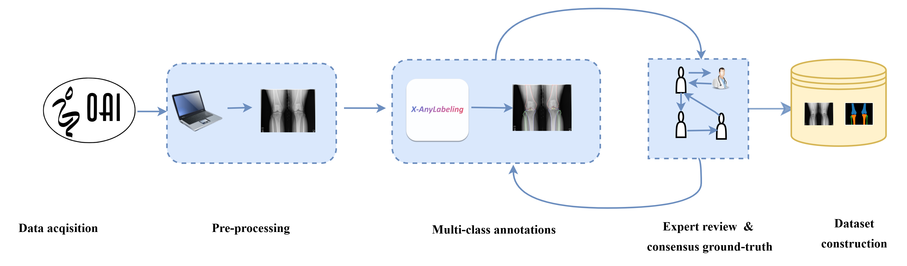

# Knee X-ray Anatomy Segmentation

Multi-class semantic segmentation of knee anatomical structures from X-ray images using deep learning.

## Overview

This project addresses the problem of multi-class anatomical segmentation
of knee joint structures from X-ray images.

The input is a single-channel knee X-ray image, and the output is a pixel-wise
segmentation map consisting of K anatomical classes and one background class.

## Method / Pipeline

The overall pipeline of the proposed knee X-ray anatomy segmentation framework
is illustrated in the following figure.




## Dataset

The dataset consists of knee X-ray images collected from the
Osteoarthritis Initiative (OAI).

Due to licensing restrictions, the dataset is not included in this repository.

## Label Definition

tus
Each pixel is assigned to one of the following classes:

| ID  | Class Name | Description           |
| --- | ---------- | --------------------- |
| 0   | Background | Non-anatomical region |
| 1   | Femur      | Distal femur          |
| 2   | Tibia      | Proximal tibia        |
| 3   | Patella    | Patella               |
| 4   | Joint      | Joint space           |
| 5   | ...        | ...                   |

## Installation

```bash
conda create -n knee-seg python=3.10
conda activate knee-seg
pip install -r requirements.txt

```
